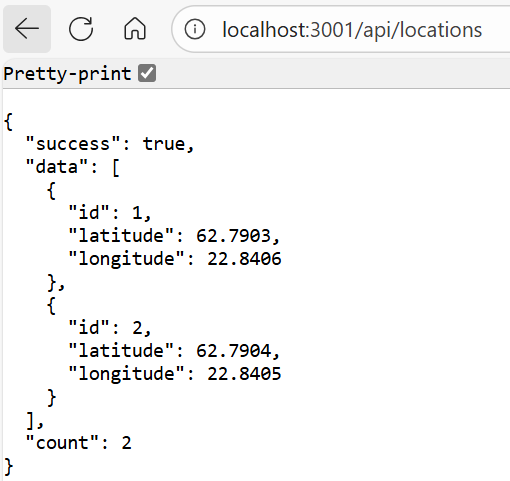

# Sijaintidatan näyttäminen kartalla — (Express, React, Leaflet ja Socket.IO)

Tässä dokumentissa kerrotaan, miten tehdään yksinkertainen web-sovellus, joka näyttää sijaintitetoa kartalla.

Sovellus tehdään Helsingin yliopiston [Full Stack open](https://fullstackopen.com/) -kurssin luvuissa 1—3 opetettujen periaatteiden mukaan.

Sovellus koostuu kolmesta osasta:
- Frontend (selaimessa ajettavassa asiakassovellus): React-sovellus, joka näyttää reitin OpenStreetMap-kartalla käyttäen Leaflet-pakettia. Reitin koordinaattipisteet näytetään myös listassa.
- Backend (palvelinsovellus): Express.js-sovellus, joka vastaanottaa GNSS-vastaanottimelta tai simulaattorilta saatua sijaintitietoa. Sijaintitiedot tallennetaan listaan.
- Simulator: Python-ohjelma, joka lähettää sijaintitietoa (latitude, longitude) HTTP POST -metodilla backend-sovellukselle.

Sovelluksessa käytetään Socket.IO-pakettia palvelimen ja asiakkaan väliseen kommunikointiin. Socket.IO:n avulla selaimessa näytettävä reitti päivittyy reaaliajassa, kun palvelin saa uutta dataa.

## Leaflet React-sovelluksessa

[Leaflet](https://leafletjs.com/) on avoimen lähdekoodin JavaScript-kirjasto, jonka avulla voi rakentaa web-pohjaisia karttasovelluksia. Leafletin avulla voidaan näyttää GeoJSON-muotoista paikkatietoa kartalla. Periaatteessa karttatiedon näyttämiseen riittää kuitenkin vain tieto pisteen pituus- ja laveyspiiristä. Leafletia voidaan käyttää yhdessä esimerkiksi ilmaisen [OpenStreetMap](https://www.openstreetmap.org/)-karttarajapinnan kanssa.


Tässä harjoituksessa käytetään [React Leaflet](https://react-leaflet.js.org/)-pakettia, joka mahdollistaa nimensä mukaisesti Leafletin käyttämisen React-sovelluksessa.

Leafletin ja OpenStreetMapin sijaan karttasoveluksen voi tehdä esimerkiksi Google Maps Platformin tai MapQuestin palveluja käyttäen. Nämä palvelut vaativat kuitenkin luottokorttitietojen antamisen.

## Socket.io

[Socket.io](https://socket.io/) on reaaliaikaisten web-sovellusten tekemiseen tarkoitettu JavaScript-kirjasto. Socket.io:n avulla tehdään kaksisuuntaisen yhteys web-asiakkaan ja palvelimen välille. Socket.io-yhteys mahdollistaa datan työntämisen palvelimelta asiakkaille, mikä ei onnistu pelkkää HTTP-protokollaa käyttämällä.

Socket.io:ssa on oma kirjasto sekä asiakkaalle että palvelimelle. APIt ovat lähes samanlaiset.
Socket.io käyttää Web Socketteja. Socket.io tuo Web Sockettiin lisää toiminnallisuutta, kuten broadcastingin useille asiakkaille ja asynkronisen I/O:n. Socket.io:n avulla voidaan tehdä web-sovellus, jossa sivu päivittyy automaattisesti aina, kun palvelimelle tulee uutta dataa esimerkiksi HTTP POST -metodin välityksellä.

# Esimerkkisovelluksen tekeminen

Tässä ohjeessa kaikki kolme sovelluksen osaa (backend, frontend ja simulaattori) tehdään omiin hakemistoihinsa. Sovellukset käynnistetään myös erikseen.

Tee alla oleva hakemistorakenne:

React-Express-SocketIO-Example/
├── backend/
├── frontend/
├── simulator/

## Backend (Experss.js-palvelinsovellus)

### Asetukset package.json-tiedostoon

Alusta backend samalla tavalla kuin Full Stack open -kurssin luvun [3a](https://fullstackopen.com/osa3/node_js_ja_express) on neuvottu:

1. Mene hakemistoon React-Express-SocketIO-Example/backend ja avaa command prompt.
2. Anna komento npm init. Voit jättää kaikki kysytyt kohdat tyhjiksi.

Tuloksena syntyy tiedosto package.json backend-hakemiston juureen.

3. Avaa package.json. Lisää rivi ```"type": "module",``` päätasolle sekä scripts-osion alle kaksi riviä "start" ja "dev" alla olevan mallin mukaan.
   
```json
{
  // ...
  "type": "module",
  "scripts": {
    "start": "node index.js",
    "dev": "node --watch index.js",
    "test": "echo \"Error: no test specified\" && exit 1"
  },
  // ...
}
```
### Pakettien asennus

Asenna tässä sovelluksessa tarvittavat paketit
```
npm install express
npm install cors
npm install socket.io
```  

### Backendin alustukset ja käynnistys

Tee backend-hakemistoon uusi tiedosto index.js. Lisää tiedoston alkuun tarvittavat importit: 
```javascript
import express, { json } from 'express';
import cors from 'cors';
import { createServer } from 'http';
import { Server } from 'socket.io';
```

Lisää sitten sovelluksessa tarvittavat alustustoimenpiteet:
```javascript
// Create Express app
const app = express();
// Create HTTP server
const server = createServer(app);

// Initialize Socket.IO server
const io = new Server(server, {
  // enable CORS for Socket.IO connections
  cors: {
    origin: "http://localhost:5173",
    methods: ["GET", "POST"]
  }
});

const PORT = process.env.PORT || 3001;

// Enable CORS for all routes (HTTP connections)
app.use(cors());

// Parse JSON bodies
app.use(json());
```

Ensimmäisellä rivillä
```javascript
const app = express();
```
luodaan Express-sovelluksen instanssi. Syntyvän app-nimisen kautta päästään käsittelemään palvelimelle saapuvat HTTP-pyynnöt (esimerkiksi GET ja POST).

Seuraava rivi
```javascript
const server = createServer(app);
```
käärii Express-sovelluksen Node.js:n natiivin HTTP-palvelimen sisään. Syntyvän server-olion kautta päästään käsiksi HTTP-palvelimen raakaversioon, jota taas tarvitaan Socket.IO:ta varten.

Seuraavaksi alustetaan Socket.IO-palvelin:
```javascript
const io = new Server(server, {
  cors: {
    origin: "http://localhost:5173",
    methods: ["GET", "POST"]
  }
});
```
Parametrina annetaan muuttuja server sekä CORS-asetukset WebSocket-yhteyksiä varten.

Rivi
```javascript
app.use(cors());
```
ottaa käyttöön middlewaren, joka lisää CORS-otsikot kaikille Express-reiteille. Nyt frontend voi tehdä HTTP-pyyntöjä backendille.

Lopuksi otetaan käyttöön vielä middleware, joka jäsentää POST-pyyntöjen mukana saapuvan JSON-muotoisen datan olioiksi.
```javascript
app.use(json());
```

Lisätään vielä tiedoston loppuun HTTP-palvelimen käynnistys:
```javascript
// Start server
server.listen(PORT, () => {
  console.log(`Server running on http://localhost:${PORT}`);
});

export default app;
```
Huomaa, että tässä käytetään server-oliota app-olion (Express) sijaan. Tällä tavoin backend voi käsitellä sekä HTTP-pyynnöt että Socket.IO-yhteydet.

### Datan tallennus

Tässä sovelluksessa saapuva sijaintidata tallennetaan listaan. Listaan on laitettu malliksi kaksi pistettä.

```javascript
// Initial location data
const locations = [
  {
    id: 1,
    latitude: 62.7903,
    longitude: 22.8406
  },
  {
    id: 2,
    latitude: 62.7904,
    longitude: 22.8405
  }
];
```

### GET-pyynnön käsittely

Lisätään sovellukseen Express-route, joka palauttaa kaikki locations-listaan tallennetut pisteet JSON-muodossa.
```javascript
// Get all locations
app.get('/api/locations', (req, res) => {
  res.json({
    success: true,
    data: locations,
    count: locations.length
  });
});

```
Tämä route vastaa GET-pyyntöihin osoitteessa /api/locations. Tätä routea ei tarvita varsinaisessa sovelluksessa, sillä kommunikointi backendin ja frontendin välillä toteutetaan Socket.IO:n avulla. Routea voidaan käyttää kuitenkin sovelluksen testauksessa.

Voit ajaa backend-sovelluksen nyt komennolla
```
npm run dev
```

Käynnistä sitten selain ja kirjoita osoitekenttään
```
localhost:3001/api/locations
```

Selain näyttää listassa locations olevat pisteet.



## Frontend (selaimessa ajettavassa React-sovellus)

## Simulaattori
