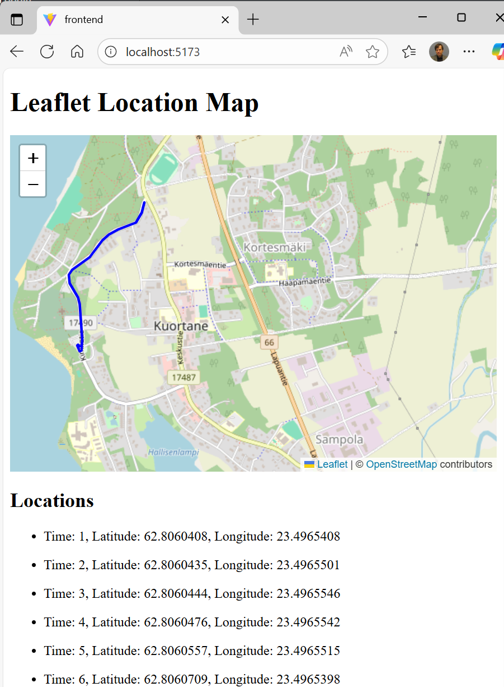

# Sijaintidatan näyttäminen kartalla — (Express, React, Leaflet ja Socket.IO)

Tässä dokumentissa kerrotaan, miten tehdään yksinkertainen web-sovellus, joka näyttää sijaintitetoa kartalla.

Sovellus tehdään Helsingin yliopiston [Full Stack open](https://fullstackopen.com/) -kurssin luvuissa 1—3 opetettujen periaatteiden mukaan.

Sovellus koostuu kolmesta osasta:
- Frontend (selaimessa ajettavassa asiakassovellus): React-sovellus, joka näyttää reitin OpenStreetMap-kartalla käyttäen Leaflet-pakettia. Reitin koordinaattipisteet näytetään myös listassa.
- Backend (palvelinsovellus): Express.js-sovellus, joka vastaanottaa GNSS-vastaanottimelta tai simulaattorilta saatua sijaintitietoa. Sijaintitiedot tallennetaan listaan.
- Simulator: Python-ohjelma, joka lähettää sijaintitietoa (latitude, longitude) HTTP POST -metodilla backend-sovellukselle.

Sovelluksessa käytetään Socket.IO-pakettia palvelimen ja asiakkaan väliseen kommunikointiin. Socket.IO:n avulla selaimessa näytettävä reitti päivittyy reaaliajassa, kun palvelin saa uutta dataa.

## Leaflet React-sovelluksessa

[Leaflet](https://leafletjs.com/) on avoimen lähdekoodin JavaScript-kirjasto, jonka avulla voi rakentaa web-pohjaisia karttasovelluksia. Leafletin avulla voidaan näyttää GeoJSON-muotoista paikkatietoa kartalla. Periaatteessa karttatiedon näyttämiseen riittää kuitenkin vain tieto pisteen pituus- ja leveyspiiristä. Leafletia voidaan käyttää yhdessä esimerkiksi ilmaisen [OpenStreetMap](https://www.openstreetmap.org/)-karttarajapinnan kanssa.


Tässä harjoituksessa käytetään [React Leaflet](https://react-leaflet.js.org/)-pakettia, joka mahdollistaa nimensä mukaisesti Leafletin käyttämisen React-sovelluksessa.

Leafletin ja OpenStreetMapin sijaan karttasoveluksen voi tehdä esimerkiksi Google Maps Platformin tai MapQuestin palveluja käyttäen. Nämä palvelut vaativat kuitenkin luottokorttitietojen antamisen.

## Socket.IO

[Socket.IO](https://socket.io/) on reaaliaikaisten web-sovellusten tekemiseen tarkoitettu JavaScript-kirjasto. Socket.IO:n avulla tehdään kaksisuuntaisen yhteys web-asiakkaan ja palvelimen välille. Socket.IO-yhteys mahdollistaa datan työntämisen palvelimelta asiakkaille, mikä ei onnistu pelkkää HTTP-protokollaa käyttämällä.

Socket.IO:ssa on oma kirjasto sekä asiakkaalle että palvelimelle. APIt ovat lähes samanlaiset.
Socket.IO käyttää Web Socketteja. Socket.IO tuo Web Sockettiin lisää toiminnallisuutta, kuten broadcastingin useille asiakkaille ja asynkronisen I/O:n. Socket.IO:n avulla voidaan tehdä web-sovellus, jossa sivu päivittyy automaattisesti aina, kun palvelimelle tulee uutta dataa esimerkiksi HTTP POST -metodin välityksellä.

# Esimerkkisovelluksen tekeminen

Tässä ohjeessa kaikki kolme sovelluksen osaa (backend, frontend ja simulaattori) tehdään omiin hakemistoihinsa. Sovellukset käynnistetään myös erikseen.

Tee alla oleva hakemistorakenne:

React-Express-SocketIO-Example/

├── backend/

├── frontend/

├── simulator/


## Backend (Experss.js-palvelinsovellus)

Backend vastaanottaa GNSS-vastaanottimelta tai simulaattorilta saatua sijaintitietoa ja tallentaa sen listaan. Backend välittää saamansa sijaintipisteet frontendille Socket.IO:n kautta.

### Asetukset package.json-tiedostoon

Alusta backend samalla tavalla kuin Full Stack open -kurssin luvussa [3a](https://fullstackopen.com/osa3/node_js_ja_express) on neuvottu:

1. Mene hakemistoon React-Express-SocketIO-Example/backend ja avaa command prompt.
2. Anna komento npm init. Voit jättää kaikki kysytyt kohdat tyhjiksi.

Tuloksena syntyy tiedosto package.json backend-hakemiston juureen.

3. Avaa package.json. Lisää rivi ```"type": "module",``` päätasolle sekä scripts-osion alle kaksi riviä "start" ja "dev" alla olevan mallin mukaan.
   
```javascript
{
  // ...
  "type": "module",
  "scripts": {
    "start": "node index.js",
    "dev": "node --watch index.js",
    "test": "echo \"Error: no test specified\" && exit 1"
  },
  // ...
}
```
### Pakettien asennus

Asenna tässä sovelluksessa tarvittavat paketit
```
npm install express
npm install cors
npm install socket.io
```  

### Backendin alustukset ja käynnistys

Tee backend-hakemistoon uusi tiedosto index.js. Lisää tiedoston alkuun tarvittavat importit: 
```javascript
import express, { json } from 'express';
import cors from 'cors';
import { createServer } from 'http';
import { Server } from 'socket.io';
```

Lisää sitten sovelluksessa tarvittavat alustustoimenpiteet:
```javascript
// Create Express app
const app = express();
// Create HTTP server
const server = createServer(app);

// Initialize Socket.IO server
const io = new Server(server, {
  // enable CORS for Socket.IO connections
  cors: {
    origin: "http://localhost:5173",
    methods: ["GET", "POST"]
  }
});

const PORT = process.env.PORT || 3001;

// Enable CORS for all routes (HTTP connections)
app.use(cors());

// Parse JSON bodies
app.use(json());
```

Ensimmäisellä rivillä
```javascript
const app = express();
```
luodaan Express-sovelluksen instanssi. Syntyvän app-nimisen kautta päästään käsittelemään palvelimelle saapuvat HTTP-pyynnöt (esimerkiksi GET ja POST).

Seuraava rivi
```javascript
const server = createServer(app);
```
käärii Express-sovelluksen Node.js:n natiivin HTTP-palvelimen sisään. Syntyvän server-olion kautta päästään käsiksi HTTP-palvelimen raakaversioon, jota taas tarvitaan Socket.IO:ta varten.

Seuraavaksi alustetaan Socket.IO-palvelin:
```javascript
const io = new Server(server, {
  cors: {
    origin: "http://localhost:5173",
    methods: ["GET", "POST"]
  }
});
```
Parametrina annetaan muuttuja server sekä CORS-asetukset WebSocket-yhteyksiä varten.

Rivi
```javascript
app.use(cors());
```
ottaa käyttöön middlewaren, joka lisää CORS-otsikot kaikille Express-reiteille. Nyt frontend voi tehdä HTTP-pyyntöjä backendille.

Lopuksi otetaan käyttöön vielä middleware, joka jäsentää POST-pyyntöjen mukana saapuvan JSON-muotoisen datan olioiksi.
```javascript
app.use(json());
```

Lisätään vielä tiedoston loppuun HTTP-palvelimen käynnistys:
```javascript
// Start server
server.listen(PORT, () => {
  console.log(`Server running on http://localhost:${PORT}`);
});

export default app;
```
Huomaa, että tässä käytetään server-oliota app-olion (Express) sijaan. Tällä tavoin backend voi käsitellä sekä HTTP-pyynnöt että Socket.IO-yhteydet.

### Datan tallennus

Tässä sovelluksessa saapuva sijaintidata tallennetaan listaan. Listaan on laitettu malliksi kaksi pistettä.

```javascript
// Initial location data
const locations = [
  {
    id: 1,
    latitude: 62.8060408,
    longitude: 23.4965408
  },
  {
    id: 2,
    latitude: 62.8060435,
    longitude: 23.4965501
  }
];
```

### GET-pyynnön käsittely

Lisätään sovellukseen Express-route, joka palauttaa kaikki locations-listaan tallennetut pisteet JSON-muodossa.
```javascript
// Get all locations
app.get('/api/locations', (req, res) => {
  res.json({
    success: true,
    data: locations,
    count: locations.length
  });
});

```
Tämä route vastaa GET-pyyntöihin osoitteessa /api/locations. Tätä routea ei tarvita lopullisessa sovelluksessa, sillä kommunikointi backendin ja frontendin välillä tehdään Socket.IO:n avulla. Routea voidaan käyttää kuitenkin sovelluksen testauksessa.

Voit ajaa backend-sovelluksen nyt komennolla
```
npm run dev
```

Käynnistä sitten selain ja kirjoita osoitekenttään
```
localhost:3001/api/locations
```

Selain näyttää listassa locations olevat pisteet.


### POST-pyynnön käsittely

Paikannusta tekevää laitetta simuloiva ohjelma lähettää sijaintitietoa kerran sekunnissa HTTP POST -metodin avulla. Backendissä tarvitaan route, joka käsittelee vastaanotetun datan. Datan jäsentäminen JSON-muodosta olioksi tapahtuu automaattisesti json-middlewaren avulla. Varmista, että olet ottanut tämän middlewaren käyttöön ohjelman alussa (app.use(json())).

Aluksi tarkistetaan, että syöte on oikeanlainen. Tämän jälkeen luodaan olio newLocation, jossa on palvelimen generoima id ja sijaintitieto. Tämä olio tallennetaan locations-listaan ja palautetaan POST-pyynnön lähettäjälle.

Lisää seuraava route POST-pyynnön käsittelyä varten.

```javascript
// POST endpoint to add a new location
app.post('/api/locations', (req, res) => {
  const { latitude, longitude } = req.body;
  if (typeof latitude === 'number' &&
    typeof longitude === 'number')
  {
    const newLocation = {
      id: locations.length + 1,
      latitude,
      longitude
    };
    // Add new location to the array
    locations.push(newLocation);

    return res.status(201).json({
      success: true,
      data: newLocation
    });
  }
  res.status(400).json({
    success: false,
    message: 'Invalid location data'
  });
});
```
Tähän funktioon lisätään myöhemmin vielä datan lähettäminen frontendille Socket.IO:n avulla.

Testaa seuraavaksi POST-pyynnön käsittely. Ellei backend ole jo toiminnassa, käynnistä se terminaalista komennolla npm run dev.

Kokeile lähettää POST-pyyntöjä VS Code Rest Clientin avulla. Avaa sitten selaimessa sivu localhost:3001/api/locations ja varmista, että POST-pyynnöissä välitetyt sijaintipisteet on tallennettu palvelimelle. Voit tehdä tämän myös tekemällä GET-pyynnön VS Code Rest Clientilla.

Alla on testaukseen tarvittavat VS Code Rest Client -pyynnöt:
```
### Send new location data to the backend API
POST http://localhost:3001/api/locations
Content-Type: application/json

{
    "latitude": 62.80,
    "longitude": 24.95
}

### Get all location data from the backend API
GET http://localhost:3001/api/locations
```

### Socket.IO-yhteyden käsittely

Socket.IO mahdollistaa reaaliaikaisen kahdensuuntaisen viestinnän backendin ja frontendin välillä. Socket.IO mahdollistaa sen, että backend voi lähettää sijaintitietoja frontendille ilman, että frontendin tarvitsee pyytää sitä. Tällä tavoin sijainnin muutos tai reitti näkyy selaimella reaaliaikaisesti.

Sovellus on tarkoitus toteuttaa seuraavasti: Kun frontend ottaa yhteyttä backendiin, avataan näiden välille Socket.IO-yhteys. Tällöin frontendille lähetetään kaikki siihen mennessä kertynyt sijaintidata eli listan locations sisältö. Tämän jälkeen backend lähettää sijaintipisteen koordinaatit frontendille aina, kun uusi sijaintitieto saapuu.

Socket.IO:n alustus kuvattiin tällä sivulla aiemmin. Lisää ohjelmaan seuraava funktio:

```javascript
// Socket.IO connection handler
io.on('connection', socket => {
  console.log('client connected', socket.id)

  // send location data collected so far
  // to the newly connected client
  socket.emit('initialLocations', locations)

  // handle disconnection
  socket.on('disconnect', () => console.log('disconnected'))
})
```

Funktiota io.on kutsutaan, kun uusi asiakas yhdistää Socket.IO:n kautta palvelimeen. Konsoliin tulostetaan ensin asiakkaan socket-id.

Funktio socket.emit lähettää asiakkaalle tunnuksella initialLocations kaiken siihen mennessä kertyneen sijaintidatan (listan locations sisällön). Funktio kuuntelee myös asiakkaan irtautumistapahtumaa (tunnus disconnect).

Lisätään vielä POST-pyynnön käsittelystä vastaavaan funktioon uusimman sijaintitiedon lähettäminen asiakkaalle:

```javascript
// POST endpoint to add a new location
app.post('/api/locations', (req, res) => {
  const { latitude, longitude } = req.body;
  if (typeof latitude === 'number' &&
    typeof longitude === 'number')
  {
    const newLocation = {
      id: locations.length + 1,
      latitude,
      longitude
    };
    // Add new location to the array
    locations.push(newLocation);

    // send data to the clients
    io.emit('locationAdded', newLocation) // <--- lisää tämä rivi

    return res.status(201).json({
      success: true,
      data: newLocation
    });
  }
  res.status(400).json({
    success: false,
    message: 'Invalid location data'
  });
});
```

Backend on nyt valmis ja se pystyy välittämään POST-metodin kautta saadun sijaintitiedon Socket.IO:lla frontendille. Backendin koodi löytyy [täältä](https://github.com/SeAMKedu/React-Express-SocketIO-Example/blob/main/backend/index.js).

## Simulaattori

Tehdään seuraavaksi simulaattori, joka matkii GNSS-vastaanottimen toimintaa. Simulaattori lukee tiedostosta aiemmin kerättyä sijaintitietoa ja lähettää sen HTTP POST -metodin avulla palvelimelle (backend). 

Halutessasi voit tehdä myös ohjelman, joka lukee GNSS-vastaanottimelta tietokoneen USB-porttiin saapuvaa sijaintitietoa ja lähettää sitä backend-sovelluksessa HTTP POST -viestin välityksellä. Voit kerätä sijaintitietoa myös itse puhelimessa olevalla sovelluksella tallentaa sitä esimerkiksi GPX-muodossa.

Tässä ohjeessa käytetään valmiiksi kerättyä sijaintidataa, joka on tallennettu tiedostoon positions.json. Tiedosto löytyy [täältä](https://github.com/SeAMKedu/React-Express-SocketIO-Example/blob/main/simulator/positions.json).

Tiedoston positions.json sisältö näyttää tältä:
```
[
  {
    "time": 3,
    "lat": 62.8060439,
    "lon": 23.4965541
  },
  {
    "time": 4,
    "lat": 62.8060444,
    "lon": 23.4965546
  },
  {
    "time": 5,
    "lat": 62.8060476,
    "lon": 23.4965542
  },
  ...
]
```

Voi olla selkeintä, että avaat oman VS Coden simulaattorin tekemistä ja testaamista varten.

Simulaattori tehdään Python-ohjelmointikielellä. Asenna HTTP-kommunikointia varten requests-paketti:
```
pip install requests
```

Tee simulator-hakemiston alle uusi tiedosto datagenerator.py.

Tee sitten simulaattoriohjelma alla olevan esimerkin mukaisesti:
```python
import json
import requests
import time

url = "http://localhost:3001/api/locations"
headers = {"Content-Type": "application/json"}

# Read file positions.json 
with open("positions.json", "r", encoding="utf-8") as file:
    positions = json.load(file)

# Loop through positions and send each as a POST request
for position in positions:
    location_data = {
        "id": position["time"],
        "latitude": position["lat"],
        "longitude": position["lon"]
    }

    print(location_data)
    response = requests.post(url, headers=headers, data=json.dumps(location_data))
    print(response)
    time.sleep(2)
```
Simulaattoriohjelma löytyy myös [täältä](https://github.com/SeAMKedu/React-Express-SocketIO-Example/blob/main/simulator/datagenerator.py).

Testataan seuraavaksi simulaattorin toiminta.

Mene ensin backend-hakemistoon ja käynnistä backend komennolla npm run dev.

Siirry sitten simulaattorin puolelle ja käynnistä simulaattori komennolla py datagenerator.py.

Varmista, että backend vastaanottaa simulaattorin tuottaman datan. Avaa selain ja osoitteeksi localhost:3001/api/locations. Kun päivität selaimen, backendin vastaanottama sijaintidata pitäisi näkyä ikkunassa.

## Frontend

Tehdään React-sovellus, joka näyttää reitin OpenStreetMap-kartalla käyttäen Leaflet-pakettia. Reitin koordinaattipisteet näytetään myös listassa.

### Alustukset

Alusta frontend samalla tavalla kuin Full Stack open -kurssin luvussa [1a](https://fullstackopen.com/osa1/reactin_alkeet) on neuvottu:

Mene hakemistoon React-Express-SocketIO-Example/frontend.

Luo uusi sovellus create-vite-työkalun avulla:

```
npm create vite@latest
```

Vastaa kysymyksiin alla olevan esimerkin mukaisesti. Koska olet jo frontend-alihakemistossa, anna kohtaan ```Project name``` piste (.). Tällöin ei tehdä enää uutta alihakemistoa.

```
> npx
> create-vite
o  Project name:
|  .
o  Select a framework:
|  React
o  Select a variant:
|  JavaScript
o  Use rolldown-vite (Experimental)?:
|  No
o  Install with npm and start now?
|  No
o  Scaffolding project in React-Express-SocketIO-Example/frontend...
```

Varmista, että olet frontend-hakemistossa. Asenna sitten sovelluksen tarvitsemat kirjastot:
```
npm install
```

Käynnistä React-sovellus:
```
npm run dev
```

Tarkista, että sovellus toimii. Avaa selain ja anna osoite http://localhost:5173/. 

Sovelluksen koodi on hakemistossa src. Yksinkertaistetaan valmiina olevaa koodia samalla tavoin kuin Fullstackopen-materiaalissa. Poista tiedostot App.css ja index.css sekä hakemisto assets.

Muuta tiedoston main.jsx sisältö seuraavaksi:
```javascript
import ReactDOM from 'react-dom/client'
import App from './App'

ReactDOM.createRoot(document.getElementById('root')).render(<App />)
```

Korvaa tiedoston App.jsx koodi seuraavalla koodilla:
```javascript
const App = () => (
  <div>
    <p>Karttasovellus</p>
  </div>
)

export default App
```

Testaa selaimessa, että sovellus toimii edelleen.

### React Leaflet- ja Socket.IO-kirjastojen asennus

Asenna react-leaflet- ja socket.io-client-kirjastot

```
npm install socket.io-client react-leaflet
```

### Importit

Avaa tiedosto App.jsx ja lisää tiedoston alkuun Leafletin, React-Leafletin ja Socket.IO:n tarvitsemat importit:

```javascript
import {
    MapContainer,
    TileLayer,
    Polyline
} from 'react-leaflet';

import 'leaflet/dist/leaflet.css';

import { useState, useEffect } from 'react';
import io from 'socket.io-client'
```

### Socket.IO

Tehdään seuraavaksi Socket.IO:n vaatima toiminnallisuus. Muuta App-komponenttia alla olevan mallin mukaan.

Tilamuuttuja locations sisältää listan sijaintitiedoista. Listan sisältö renderöidään ohjelman lopussa return-lauseessa.

Lisää myös useEffect-funktion runko alla olevan mallin mukaan.

```javascript
const App = () => {
  const [locations, setLocations] = useState([])

  useEffect(() => {
    console.log('useEffect')
  } , [])

  return (
    <div>
      <h1>Leaflet Location Map</h1>
      {locations.length > 0 && (
        <ul>
          {locations.map((location) => (
            <li key={location.id}>
              <p>Time: {location.id}, Latitude: {location.latitude},
                Longitude: {location.longitude}</p>
            </li>
          ))}
        </ul>
      )}
    </div>
  )
}
```

Socket.IO-yhteyden hallinta sijoitetaan effect-hookiin eli funktioon useEffect. Efekti eli useEffectille parametrina annettu funktio suoritetaan heti komponentin renderöinnin jälkeen. Effect-hookeista on kerrottu lisää [täällä](https://fullstackopen.com/osa2/palvelimella_olevan_datan_hakeminen).

Muuta funktiota useEffect alla olevan mallin mukaiseksi:

```javascript
  useEffect(() => {
    console.log('useEffect')
    // Connect to Socket.IO server
    const socket = io('http://localhost:3001');

    // Handle initial location data
    // (data already stored to the server)
    socket.on('initialLocations', (initialLocations) => {
      console.log('Received initial locations:',
        initialLocations);
      setLocations(initialLocations);
    });
     // Handle new location data being added
      // (received by server from simulator)
    socket.on('locationAdded', (newLocation) => {
      console.log('New location added:', newLocation);
      setLocations(prev => [...prev, newLocation]);
    });
     // Cleanup on unmount
    return () => {
      socket.off('initialLocations');
      socket.off('locationAdded');
      socket.disconnect();
    }
  } , [])
```

Funktio useEffect ajetaan kerran, kun komponentti renderöidään. Aluksi avataan Socket:IO-yhteys palvelimeen. Tämän jälkeen rekisteröidään kuuntelijat socket.on('initialLocations', ...) ja socket.on('locationAdded', ...), jotka reagoivat palvelimen lähettämiin viesteihin ohjelman ajon aikana.

Kuuntelija socket.on('initialLocations', ...) ottaa vastaan palvelimelle frontendin käynnistymiseen mennessä tallennetut sijaintitiedot ja tallentaa nämä locations-listaan. Palvelin lähettää nämä tiedot Socket.IO-yhteyden avaamisen jälkeen.

Kuuntelija socket.on('initialLocations', ...) ottaa vastaan palvelimelta reaaliajassa lähetettyjä sijaintipisteitä. Sijaintipisteet tallennetaan locations-listan loppuun yksi kerrallaan aina niiden saapuessa.

Koska sijaintipisteet tallennetaan listaan tilan päivittävällä funktiolla setLocations, renderöidään komponentti automaattisesti uudelleen. Näin ollen uusi data tulee näkymään automaattisesti.

Siirretään vielä locations-listan näyttäminen App-komponentista omaan komponenttiinsa ShowLocationsInList.

```javascript
const ShowLocationsInList = ({locations}) => {

  return (
    <div>
      <h2>Locations</h2>
      <ul>
        {locations.map((location) => (
          <li key={location.id}>
            <p>Time: {location.id}, Latitude: {location.latitude}, Longitude: {location.longitude}</p>
          </li>
        ))}
      </ul>
    </div>
  )
}
```

Tätä komponenttia kutsutaan App-komponentista näin:

```javascript
const App = () => {

  ...

  return (
    <div>
      <h1>Leaflet Location Map</h1>
      {locations.length > 0 && (
        <>
          <ShowLocationsInList locations={locations} />
        </>
      )}
    </div>
  )
}
```

Testaa sovellusta nyt simulaattorin kanssa ja varmista, että Socket.IO-yhteys toimii.

1. Käynnistä backend-sovellus backend-hakemistossa komennolla npm run dev.
2. Käynnistä simulaattori simulator-hakemistossa komennolla py datagenerator.py
3. Käynnistä frontend frontend-hakemistossa komennolla npm run dev
4. Avaa selain osoitteessa localhost:5173.

### Reitin näyttäminen react-leaflet-paketin avulla

Frontendin tarkoitus on näyttää reitin OpenStreetMap-kartalla. Tässä käytetään apuna [react-leaflet-pakettia](https://react-leaflet.js.org/).

React-leaflet mahdollistaa Leaflet-karttojen käytön React-komponenteissa. Sen avulla voidaan näyttää karttoja, pisteitä, reittejä ja muita paikkatietoja React-sovelluksessa. Kartta ja sen elementit (esim. Marker, Polyline) määritellään komponentteina, jolloin ne päivittyvät automaattisesti Reactin tilan mukaan.

Tehdään seuraavaksi funktio, joka näyttää kuljetun reitin karttapohjalla.

Lisää komponentti ShowMap tiedostoon App.jsx:

```javascript
const ShowMap = ({locations}) => {

  // Create an array of [latitude, longitude] pairs for the Polyline
  const positions = locations.map(location => [location.latitude, location.longitude]);

  return (
    <MapContainer
      center={positions[0]}
      zoom={12}
      style={{height: "400px"}}
      >
      <TileLayer
        attribution='&copy; <a href="https://www.openstreetmap.org/copyright">OpenStreetMap</a> contributors'
        url="https://{s}.tile.openstreetmap.org/{z}/{x}/{y}.png"
      />
      <Polyline positions={positions} color="blue" />
    </MapContainer>
  )
}
```

Ensimmäisellä rivillä
```javascript
const positions = locations.map(location => [location.latitude, location.longitude]);
```
muutetaan lista sijainneista Leafletin vaatimaan muotoon. Lista locations sisältää alunperin olioita. Kukin listan olio muutetaan listaksi, jossa on alkioina leveys- ja pituusasteet. Lopputuloksena on siis lista listoja.

Komponentti MapContainer on react-leafletin pääkomponentti, joka alustaa ja näyttää kartan React-sovelluksessa. Sille annetaan parametrina kartan keskipiste (center), zoomaustaso ja korkeus. Korkeus on pakko antaa, sillä muuten kartta ei tule näkyviin. 

Komponenttia TileLayer käytetään tässä sovelluksessa kartan näyttämiseen. Attribuuteissa määritellään, että käytetään OpenStreetMap-palvelun karttaa.

Reitti piirretään karttaan Polyline-komponentin avulla. Polylinelle annetaan parametrina lista sijainneista.

## Sovelluksen kokeilu

Testaa lopuksi koko sovellus:
- Mene backend-hakemistoon ja käynnistä palvelin komennolla npm run dev
- Mene frontend-hakemistoon ja käynnistä selainsovellus komennolla npm run dev
- Käynnistä selain ja anna osoite localhost:5173
- Mene simulator-hakemistoon ja käynnistä simulaattori komennolla py datagenerator.py

Kohteen eteneminen näkyy nyt karttapohjalla selaimessa.



Tästä repositoriosta löytyy myös valmiit ratkaisut.
